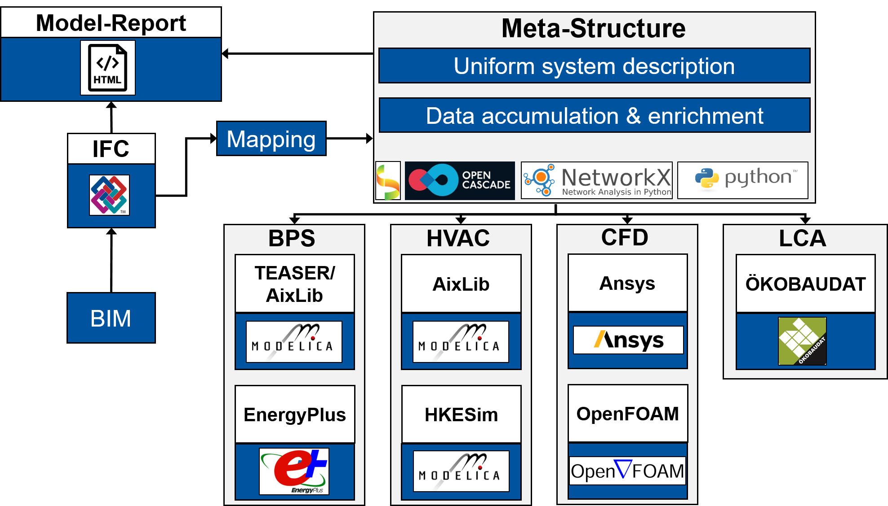

# BIM2SIM
bim2sim is a library to create simulation models for different purposes based on BIM models in the .ifc format. The project is based on a base code that provides the possiblity to map the .ifc data into a uniform meta strucuture. This structure can then be used to create simulation models for different purposes which is done by plugins. Currently the four domains 
* Building Performance Simulation (BPS)
* Heating, Ventilation, Air Conditioning (HVAC)
* Computational Fluid Dynamics (CFD)
* Life Cycle Assessment (LCA) 
are included. The basic structure is shown below: 


tbd.

During development make sure your PYTHONPATH knows 
where to find bim2sim and plugin folders.

## Install
### Pip install
````
1) conda create -n bim2sim python=3.9
2) conda activate bim2sim
3) python setup.py install/ pip install bim2sim==0.1.dev0
4) conda install -c conda-forge ifcopenshell -y 
4) conda install -c conda-forge pythonocc-core=7.6.2 -y
````
### Conda install
````
1) conda create -n bim2sim python=3.9
2) conda activate bim2sim
3) conda install bim2sim
````
###Plugins
In anaconda environment.
````
pip install -r bim2sim\plugins\PluginTEASER\requirements.txt
````


## Quick start

Bim2sim consists of three main objects:
- `Project`s, which wrap inputs like IFC files, intermediate states nd results
- `Task`s, which define a specific task and are executed from within a project
- `Decision`s, which occur during Task execution 
  if additional information is required from the user

### Command line

CAUTION: Until bim2sim is properly installed as python package, 
you have to be specific with paths. In the following our working directory is 
considered to be parent folder of `/bim2sim`.

show help

    python bim2sim -h

create new project

    python bim2sim project create path\to\project -o

then set backend in `path\to\project\config.ini` and copy an IFC file to `path\to\project\ifc` manually.
Or create new project with specific simulation tool and ifc

    python bim2sim project create path\to\project -s hkesim -i path\to\some.ifc

When your project setup is done, type

    python bim2sim project load path\to\project

to start/load the project. 
During the project execution you will be prompt to answer several `Decision`s.
After the project has completed, you can find the results in `path\to\project\export`.

### Import code

You can use `bim2sim` like this:

```python
from bim2sim import Project

PROJECT_PATH = "path/to/project"
IFC_PATH = "Path/to/some.ifc"

project = Project.create(PROJECT_PATH, IFC_PATH, 'hkesim')

def get_answer():
    return 42

for decisions in project.run():
    for decision in decisions:
        # replace this with your logic to get answers
        print(decision.question)
        decision.value = get_answer()
````
