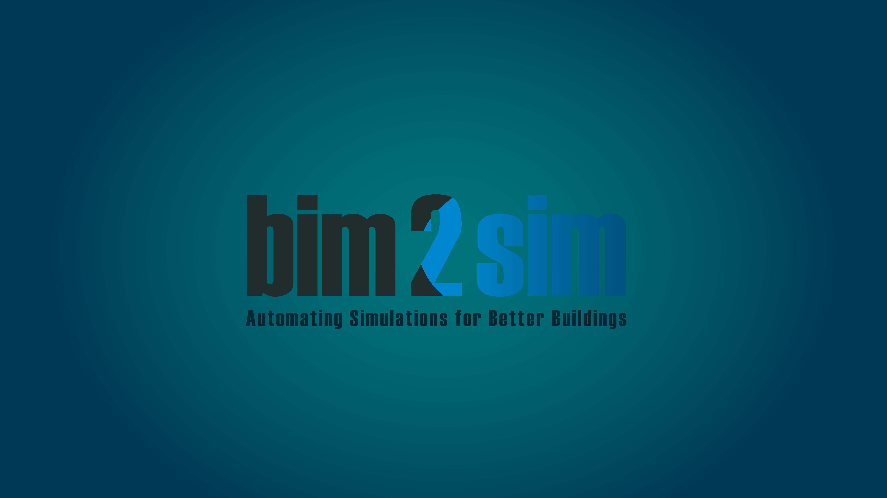
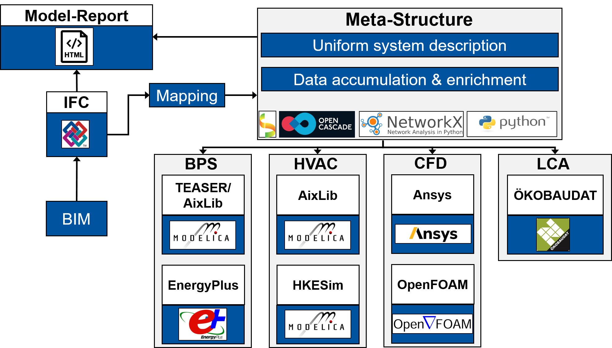

#  BIM2SIM 

bim2sim is a library to create simulation models for different purposes based on BIM models in the IFC format. The project is based on a base code that provides the possiblity to map the IFC data into a uniform meta strucuture. This structure can then be used to create simulation models for different purposes which is done by plugins. The corresponding project BIM2SIM (see founding section below) adressed the following four domains:

* Building Performance Simulation (BPS)
* Heating, Ventilation, Air Conditioning (HVAC)
* Computational Fluid Dynamics (CFD)
* Life Cycle Assessment (LCA) 

The focus of the currently released tool is on BPS and HVAC but we already provide basic methods for CFD and LCA as well. The base structure is shown below: 

## Installation and Usage
You can find detailed documentation and description how to install and to use in our [documentation](https://bim2sim.github.io/bim2sim//development/docs/overview.html). We recommend reading at least:
* [Big Picture](https://bim2sim.github.io/bim2sim//development/docs/overview.html)
* [Installation](https://bim2sim.github.io/bim2sim//development/docs/installation.html)
* [First Steps](https://bim2sim.github.io/bim2sim//development/docs/first-steps.html)

For questions like why we don't use pip and if we support docker we refer to the linked documentation.

## Related Publications
* [Final Report of BIM2SIM project](https://www.tib.eu/en/search/id/TIBKAT:1819319997)
* [Jansen et al., BIM2SIM - Development of semi-automated methods for the generation of simulation models using Building Information Modeling, Proceedings of Building Simulation 2021: 17th Conference of IBPSA in Bruges](https://doi.org/10.26868/25222708.2021.30228)
* [Jansen et al., Examination of Reduced Order Building Models with Different Zoning Strategies to Simulate Larger Non-Residential Buildings Based on BIM as Single Source of Truth, Proceedings of 14th Modelica Conference 2021, Linköping, Sweden](https://doi.org/10.3384/ecp21181665)
* [Richter et al., Validation of IFC-based Geometric Input for Building Energy Performance Simulation, 2022 Building Performance Analysis Conference and SimBuild co-organized by ASHRAE and IBPSA-USA](https://doi.org/10.26868/25746308.2022.C033)
* [Richter et al., Algorithms for Overcoming Geometric and Semantic Errors in the Generation of EnergyPlus Input Files based on IFC Space Boundaries, 32. Forum Bauinformatik 2021](https://tuprints.ulb.tu-darmstadt.de/21521/)
* [Fichter et al., Automatic generation of second level space boundary geometry from IFC models, Proceedings of Building Simulation 2021: 17th Conference of IBPS](https://doi.org/10.26868/25222708.2021.30156)
* [Junck et al., Geometrische Transformation von IFC-Raumbegrenzungsflächen für die normkonforme thermische Gebäudesimulation, Proceedings of 33. Forum Bauinformatik, 2022](https://doi.org/10.14459/2022md1686600)

## Acknowledgements
The tool was developed during the project "BIM2SIM - Methodenentwicklung zur Erstellung von Simulationsmodellen aus Daten des Building Information Modeling". The project was funded by the Federal Ministry for Economic Affairs and Energy in germany under the grant number 03ET1562A. The ongoing development is funded by the follow up project "BIM2Praxis - Integration of methods for the creation of simulation models based on Building Information Modeling into practice" with funding from the Federal Ministry for Economic Affairs and Climate Action under the grant number 3EN1050A. The authors of the tool gratefully acknowledge the financial support of the German Federal Ministry for Economic Affairs and Energy and the Federal Ministry for Economic Affairs and Climate Action in Germany.

## License
bim2sim is developed and released by the following three partners under the [LGPL-3.0 license](https://github.com/BIM2SIM/bim2sim/blob/main/LICENSE):
* [Institute for Energy Efficient Buildings and Indoor Climate (RWTH Aachen University)](https://www.ebc.eonerc.rwth-aachen.de/cms/~dmzz/E-ON-ERC-EBC/)
* [E3D - Institute of Energy Efficiency and Sustainable Building (RWTH Aachen University)](https://www.e3d.rwth-aachen.de/cms/~iyld/E3D/?lidx=1)
* [ROM Technik GmbH](https://www.rom-technik.de/home/)

## Upcoming Features:
bim2sim is still under heavy development and you can find a lot of features that we want to improve or implement inside the issue section. Anyway here are some of the major ones that we plan to implement:
* [ ] release of an interactive webtool that has its own inbuilt IFC viewer to support decision making along the model geenration process
* [ ] interactive visualization of hydraulic networks graphs for HVAC part 
* [ ] implementation of curtain walls for BPS part
* [ ] support of AHU and ventilation simulations with Modelica
* [ ] automated integration of weather files based of location of building
* [ ] ... have a look at the [https://github.com/BIM2SIM/bim2sim/issues](issues)
