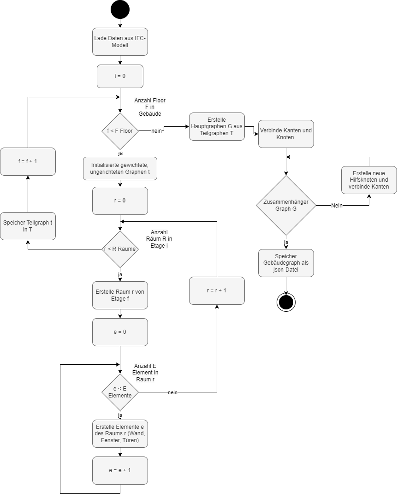
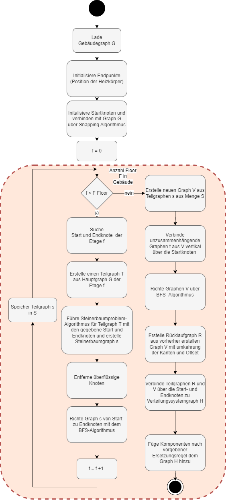

## Creation of the building graph (create_building_graph.py)

### Knotenattribute
| Knotenart              | Attribute        | Typ           | Einstellungen       | Beschreibung                                                   |
|------------------------|------------------|---------------|---------------------|----------------------------------------------------------------|
| Gebäudegraph Knoten   |                  |               |                     |                                                                |
|                        | ID_element       | str           | Element.guid        | Einzigartige ID des Elements                                   |
|                        | pos              | List(tuple1)  | Element.verts       | Liste von drei dreidimensionalen Punkten (x,y,z) jeweils als tuple |
|                        | Element_type     | str           | Ifc_type            | Art des Elements: IfcWallStandardCase, IfcDoor, IfcWindow, IfcSpace |
|                        | Node_type        | str           | Building:           | - "ifc_element_node", - "snapped_node_IfcWindow" - snapped_node_IfcDoor - snapped_node_IfcWallStandardCase |
|                        |                  |               | Building_heatingcircle: | - "delivery_supply", - "delivery_node_supply", - "source", - "distributor" |
|                        | Color            | str           | "red", "black"      | Farbe des Knotens                                              |
|                        | Belongs_to_room  | list          | Tz.guid             | Gibt die Beziehung des Elements zu welchem Raum (Room_ID) der Knoten gehört |
|                        | Belongs_to_element | list        | Element.guid        | Gibt die Beziehung des Elements zu welchem Element (Element_ID) der Knoten gehört |
|                        | Belongs_to_storey | str          | Storey.guid         | Gibt die Beziehung des Elements zu welchem Storey ("storey_iD") der Knoten gehört |
|                        | Direction        | str           | x, y, oder z        | Gibt die Richtung an, wie die Knoten und deren Elemente im Koordinatensystem ausgerichtet sind |
|                        | Grid_type        | str           | "building", "supply_line", "return_line" | Art des Erstellens des Graphen                                  |
| Verteilungssystem Knoten |                  |               |                     |                                                                |
|                        | Component_type   | Str           | - "radiator", - "underfloor_heating" | Gibt die Komponentenart des Knotens an (z.B. Radiator)         |

### Kantenattribute

| Kantenart             | Attribute        | Typ           | Einstellungen       | Beschreibung                                                   |
|-----------------------|------------------|---------------|---------------------|----------------------------------------------------------------|
| Gebäudegraph Kanten  |                  |               |                     |                                                                |
|                       | Color            | Str           | "red"               | Farbe der Kanten                                               |
|                       | Element_type     | list          | IfcWallStandardCase, IfcDoor, IfcWindow, IfcSpace | Art des Elements der Kante                                       |
|                       | Edge_type        | str           | - Element, - Snapped_edge - rise_tube | Art der Kante des Graphen                                       |
|                       | Direction        | Str           | x, y, z             | Richtung, in welche die Kante gelegt wird                      |
|                       | Grid_type        | Str           | - "building", - "heating_circle" | Art des Erstellens des Graphen                                  |
|                       | length           |                |                     | Länge der Kante                                                |

### Ablauf des Gebäudegraphs

## Creation of the heating graph (create_heating_tree_base.py)

### Ablauf der Erstellung des Verteilungssystem

