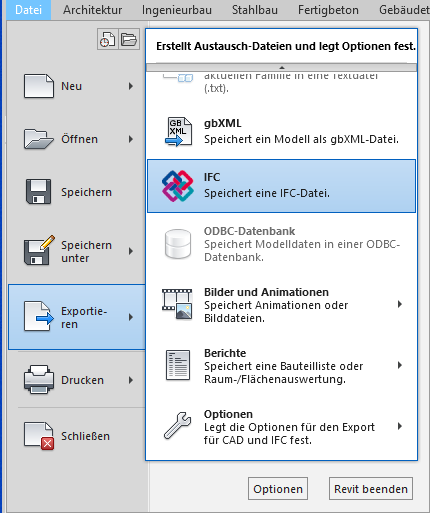
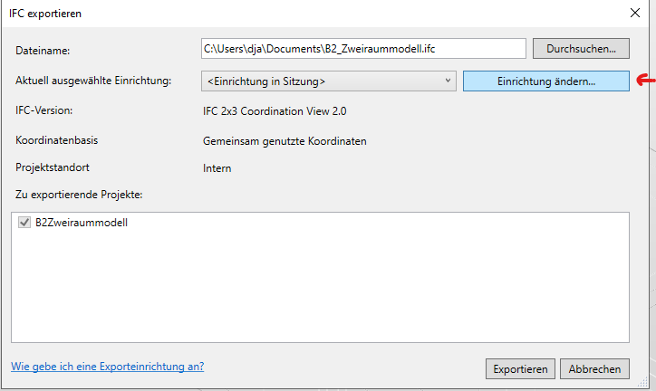
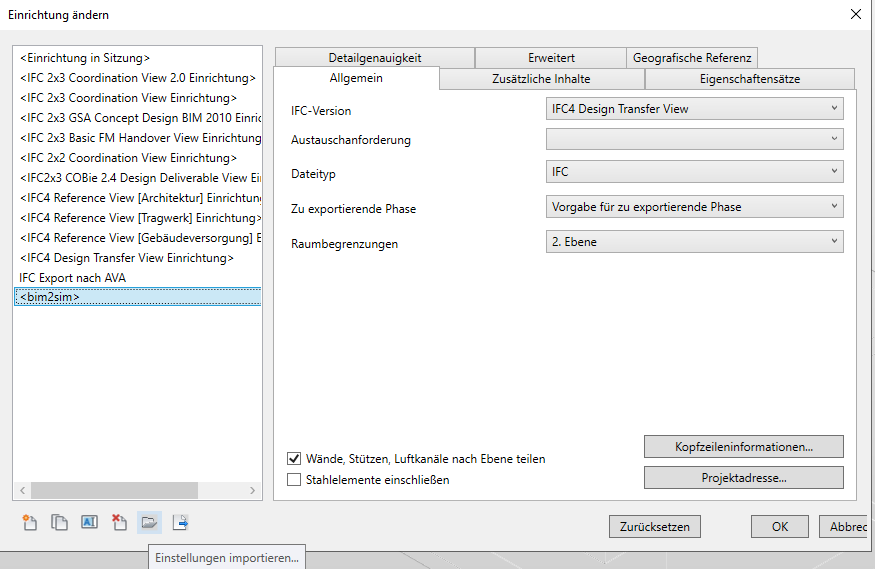
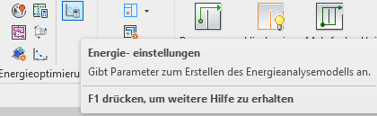
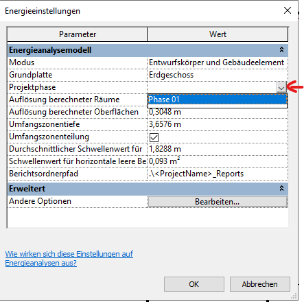
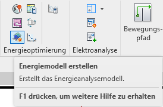

# Simulation Types

## Building Performance Simulation (BPS)

BPS dynamically computes a building's heating and cooling loads for a chosen
period. The simulation results are a base for the design of heating and cooling
systems. Even advanced renewable energy systems that require demand management
can be sized efficiently.
A building's internal and external thermal loads vary throughout the day. The
internal temperature changes are caused by the heat exchange with the
surroundings and the building's thermal mass.

To set up a BPS, one must balance the results' robustness and the workload. The
selected level of detail of the simulation must fit the problem.

### Reasons to perform a BPS

It is the current state of the art that a high manual modeling effort is
required to create a dynamic simulation model of a building. Therefore, thermal
simulation is often performed, if at all, only for a specific time in a later
planning phase, when only a few changes to the cubature are expected.
Alternatively, static calculation methods are used, which cannot represent the
dynamic loads in the building in detail.

The `bim2sim` tool aims to automate the IFC-based creation of thermal
simulation
models to make BPS accessible for all IFC-based design processes, as the
designers can significantly influence the building's geometry in the early
design phases.
By linking the building simulation to the IFC model, cubature variants can be
simulated and evaluated without modeling effort.
The IFC-based setup of the building geometry lowers the barrier for the
detailed
dynamic thermal analysis.
The considerable CO2 savings potential is to be expected through optimal
building orientation and optimization of thermal loads in an early planning
phase.

### Requirements for BPS in bim2sim

The BPS part in `bim2sim` requires a sufficient representation of the building.
This includes a description of:

* building geometry
* materials (the building's thermal mass)
* HVAC systems (only covered with ideal loads for now. Coupled simulations are
  in scope of future releases)
* internal loads (occupancy, equipment, lighting, schedules)
* external loads (weather)
* building's location and surroundings (shadings)

This information is extracted from the IFC file. Missing data can be added
by using e.g. a template-based enrichment.

### IFC Requirements

The BPS Plugins ([PluginEnergyPlus](PluginEnergyPlus) and
[PluginTEASER](PluginTEASER)) should only be applied,
if minimum IFC requirements are fulfilled:

* IFC-Version: IFC4
* Validity: The IFC file must be valid (fulfill all rules of its schema)
* Space Boundaries: IfcRelSpaceBoundary Instances should be included of type
  2ndLevel (either IfcRelSpaceBoundary2ndLevel (optimum) or
  IfcRelSpaceBoundary with Description 2ndLevel)
* Quality of Space Boundaries: The provided space boundary data must be
  valid in terms of syntax, geometry and consistency (cf. Richter et al.:
  'Validation of IFC-based Geometric Input for Building Energy Performance
  Simulation', 2022 Building Performance Analysis Conference and SimBuild
  co-organized by ASHRAE and
  IBPSA-USA, https://doi.org/10.26868/25746308.2022.C033)

* Other IFC requirements (optional, improve model accuracy):
* Material definitions
* Shading Space Boundaries (only applicable
  for [PluginEnergyPlus](PluginEnergyPlus))

### Space Boundary Generation

To retrieve the required IfcRelSpaceBoundary that are mentioned in previous
section, you have to configure your BIM authoring tool properly. We cannot
provide up2date instructions for every tool, but we will try to give you some
information about common problems we have already encountered.

#### Autodesk Revit
For Revit we created a preconfigured [bim2sim export ifc settings](/bim2sim/assets/configs/revit/revit_ifc_export_bim2sim.json).
You can use this by following these steps:
1. Select IFC export in Revit 
2. Select Modify Setup
3. Click import import settings in the lower left and select our settings linked above. .
You should now see the bim2sim settings in the list.

#### Autodesk Revit importing IFC from external
During our development we also tried to import an IFC without 
IfcRelSpaceBoundarys into Revit and export it again to get the required 
obtain valid IfcRelSpaceBoundarys. We encoutered that we need to do the 
following steps:
1. Make sure that MEP rooms are created
2. Start the [energy analyse tool](https://help.autodesk.com/view/RVT/2024/ENU/?guid=GUID-7B4D4470-0152-43A7-8173-56EDE0D5027D)
settings as shown in the screenshot: 
3. Make sure that you set a phase of the model, otherwise the following steps 
won't work: 
4. Run energy analyse tool:  

5. Export IFC4 (see Autodesk Revit in section above)

Anyway we found that the resulting IfcRelSpaceBoundary instance have errors, 
which are documented in this [article](https://www.autodesk.com/support/technical/article/caas/sfdcarticles/sfdcarticles/Second-Level-Space-Boundaries-not-exported-or-wrongly-exported-to-IFC-from-Revit.html). 
Even if Autodesk writes here "No issue has been identified and the software is
behaving as designed.", this is definitely still an unsolved problem.
#### ArchiCAD
t.b.d.

#### Allplan
At the time of writing this documentation, Allplan has no functionality for the
creation of IfcRelSpaceBoundarys. 

## Heating Ventilation and Air Conditioning (HVAC) Simulation

HVAC simulations are used to simulate the behaviour of different system
components in the energy system. For now `bim2sim` focuses on the heating and
cooling generation, while ventilation and air conditioning is planned for the
future (see issue 245 # TODO github deploy).

The corresponding simulation models for heating and cooling analysis typically
include:

* hydraulic network including pipes, valves and pumps
* generation devices for heating and cooling
* consumers
* control logic

### Hydraulic Network

(hydraulic_network)=
Since it is not convenient to model every pipe, pipe fitting and all components
of the hydraulic network, one part of the creation of simulation models for
heating and cooling analysis is the abstraction of the hydraulic network.
The abstraction can be quite time-consuming and error-prone, so one of the
strengths of `bim2sim` is offering automated tasks for analysis and aggregation
of the network. To do so we convert the imported meta structure
[elements](elements_structure) and their connections into
a [HvacGraph](HvacGraph) using
[networkx](https://networkx.org/) python package.  
The possible aggregations start with quite simply aggregations like
[PipeStrand](PipeStrand) to aggregate multiple straight connected pipes, but
also include more complex aggregations
like [Underfloorheating](Underfloorheating)
which tries to identify underfloor-heating or concrete core activation as there
is
no possibility in IFC to represent these directly. You can find an overview to
all aggregations in it
the [corresponding documentation](concepts/aggregations.md).
Generation devices and consumers are also simplified in aggregations which
brings us to the next group.

### Generation Devices & Consumers

Generation devices are e.g. boilers or chillers and consumers might be
radiators
or the already mentioned underfloor-heating.

### Control Logic

Even if IFC offers the possibility to include controls, it is not very
practical
and rarely used. But for a running simulation the control logic is
indispensable. So we came up with a mix of two solutions:

1. For elements where common standard control logics exist we include these
   logics as default into the mapped Modelica models.  
   We try to gather the relevant parameters for the control from the IFC via
   the [attribute](concepts/attribute.md)
   system. One example would be the flow set temperature of a boiler. If there
   is
   no information in IFC we can either request them during export or mark them
   as
   non-existing in the exported model, so the user can input them in Modelica.
2. For custom controls and complex controls which highly depend on the system
   and the usage we offer the possibility to deactivate the internal controls
   inside
   the modelica models and allow the user to model their own controls.