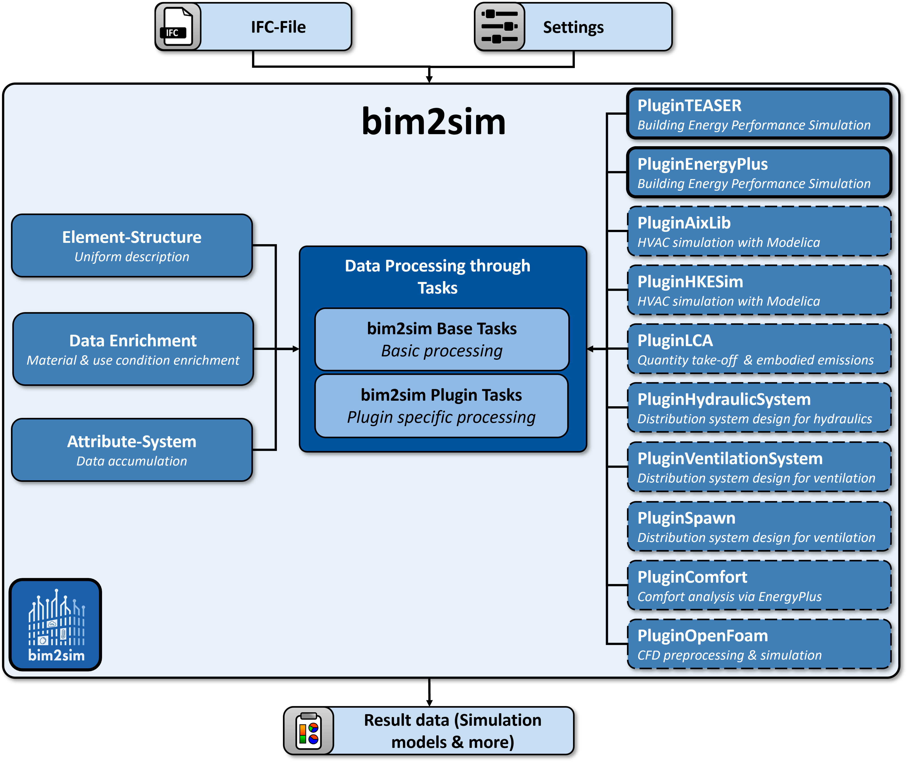

# Summary

Building Information Modeling (BIM) offers comprehensive data about buildings, but transforming this information into domain-specific simulation models remains challenging. **bim2sim** addresses this gap by providing a Python framework that transforms Industry Foundation Classes (IFC) models into simulation-ready models for multiple domains. This open-source framework implements a two-stage approach with a uniform meta-structure for IFC data extraction and domain-specific plugins for simulation model generation. The framework currently focuses on Building Performance Simulation (BPS) and Heating, Ventilation, and Air Conditioning (HVAC) simulations, with additional support for Computational Fluid Dynamics (CFD) and Life Cycle Assessment (LCA). **bim2sim**'s modular architecture handles complex tasks such as space boundary (SB) generation, thermal zoning, and building element mapping while preserving semantic relationships. The framework significantly reduces manual effort in simulation model creation while providing extensibility for future domain-specific applications.

# Statement of Need
Energy-efficient building design and operation heavily rely on Building Energy Performance Simulation (BEPS), but creating these simulation models manually is notoriously time-consuming, error-prone, and requires specialized expertise. While Building Information Modeling (BIM) provides a rich source of building data, the direct use of this information for simulation faces several challenges:

1. **Geometric Discrepancies**: Architectural BIM models employ geometric representations that differ from those required by simulation tools, necessitating complex transformations (e.g., second-level SB)
2. **Semantic Gaps**: Critical simulation parameters (material properties, usage profiles, HVAC specifications) are often missing or incompletely defined in BIM models
3. **Topological Gaps**: HVAC simulation requires accurate component connection information, but topological relationships are frequently incorrect or missing in existing BIM files
4. **Data Format Incompatibilities**: Various simulation domains and tools demand specific input formats and data schemas that differ from standard BIM exports

According to case studies cited in the literature, creating simulation models manually can take days to weeks for complex buildings, with significant risk of errors and inconsistencies. This creates a major bottleneck in the design process and limits the application of building performance simulation in practice.

**bim2sim** addresses these critical needs by:

1. Automating the transformation from IFC data to simulation models, reducing model creation time from days to under an hour for high-quality BIM inputs
2. Providing a flexible Python framework that can be easily extended to support new simulation tools and domains
3. Supporting multiple simulation domains and tools through specialized plugins (TEASER [@Remmen.2016], EnergyPlus [@EnergyPlus.2001], AixLib [@Maier.2023], Comfort, HKESim, LCA, and OpenFOAM)
4. Handling imperfect IFC data through repair algorithms and user decision management
5. Maintaining OpenBIM compatibility while minimizing external tool dependencies

The framework aims to enable engineers, architects, researchers, and practitioners to efficiently incorporate building performance simulation into their workflows, supporting better-informed decisions during design, renovation, and operation phases. By reducing the time and expertise barriers to simulation model creation, **bim2sim** helps bridge the persistent gap between building design and performance analysis.

# Architecture and Implementation

**bim2sim** is implemented in Python, making it accessible and interoperable with other tools in the building analysis ecosystem. The general structure is illustrated in Figure \autoref{fig:bim2sim_framework}.

The tool employs a two-stage architecture:

1. **Base Framework**: Transforms IFC data into a uniform meta-structure that preserves essential building information while resolving inconsistencies
2. **Domain-Specific Plugins**: Convert the meta-structure into simulation-ready models for specific applications

## Core Components

- **Elements**: Domain-specific building component classes with attributes and relationships
- **Tasks**: Modular processing steps that can be sequenced into workflows
- **Playground**: Task execution environment that manages the transformation process
- **Simulation Settings**: Configuration system for customizing simulation parameters
- **Plugins**: Domain-specific extensions for different simulation targets

## Key Features

- IFC parser that extracts geometric and semantic data utilizing the existing Python implementation of IfcOpenShell [@IfcOpenShell]
- Algorithms to correct missing or incorrect SB information
- Enrichment processes for adding missing information (materials, usage profiles) 
- Decision management for handling ambiguities in IFC data
- Exporters for different simulation platforms

## Available Plugins

**bim2sim** currently includes plugins for:

1. **TEASER**: Modelica based BEPS simulation
2. **EnergyPlus**: BEPS Simulation using EnergyPlus
3. **AixLib**: Modelica-based HVAC simulation
4. **HKESim**: Modelica-based HVAC simulation (not public available)
5. **Comfort**: Thermal comfort analysis using EnergyPlus
6. **LCA**: Life cycle assessment via  quantity takeoff
7. **OpenFOAM**: CFD simulation (under development, open-source available in fall 2025)

# Existing Publications on Methodology
* The methodology and use case demonstration for the BEPS-focused plugins **TEASER** and **EnergyPlus** will be published in a forthcoming paper by Jansen et al. [@Jansen2024bim2sim]
* The methodology and detailed implementation of the HVAC-focused plugins **AixLib** and **HKESim** are comprehensively documented in Jansen et al. [@jansen2023bim2sim]
* The algorithms for handling geometric and semantic inconsistencies within the SBs are presented in Richter et al. [@Richter.2021]
* The framework for the BEPS-focused plugin **Comfort** has been presented in Richter et al. [@richterFrameworkAutomatedIFCbased2023]. 
  The implementation of this Comfort plugin is further described and evaluated on a use case on future climate scenarios in Richter et al. [@richterExtendingIFCBasedBim2sim2023]
* The fundamentals of the methodology of the CFD-focused plugin **OpenFOAM** has been presented by Richter et al. [@richterExtendingIFCbasedFramework2024] and extended to improve mesh quality by Hochberger et al. [@hochbergerAutomatedIFCbasedMesh2024].

# Comparison with Similar Tools

**bim2sim** builds upon previous efforts to leverage BIM data for building energy simulation. In our forthcoming paper [@Jansen2024bim2sim], we conducted a comprehensive review of existing BIM-to-simulation 
approaches. Table \autoref{tab:bim2bemApproaches} provides a comparative analysis of these tools, evaluating them across several dimensions: IFC version support, space and surface boundary handling, data enrichment capabilities, simulation domain coverage (BEPS, HVAC), architectural modularity, open-source availability, and implementation technologies.

: IFC-based approaches from related research (chronologically ordered) as analyzed in [@Jansen2024bim2sim]. R: Required, G: Generation, P: Partially, Y: Yes, -: No/not applicable.\label{tab:bim2bemApproaches}

| Reference | Name | IFC Version | Spaces | SB | Enrichment | BEPS | HVAC | Modularity | open-source | Implementation |
|:----------|:-----|:------------|:-------|:---|:-----------|:-----|:-----|:-----------|:------------|:---------------|
| [@Bazjanac.2008a] | | IFC | G | G | manual | EnergyPlus | - | Y | - | - |
| [@ODonnell.2011] | SimModel | IFC | R | R | Template | EnergyPlus | - | Y | - | XML |
| [@EmiraElAsmi.2015] | | IFC2x3/IFC4 | R | - | | COMETH | COMETH | - | - | - |
| [@giannakis2015] | | IFC2x3/IFC4 | R | G | - | EnergyPlus, TRNSYS | - | - | - | -, Matlab |
| [@Cao.2018] | SimModel+ | IFC | G | G | | Modelica | Modelica | Y | - | Python, C++ |
| [@Andriamamonjy.2018] | Ifc2Modelica | IFC4 | R | R | Spreadsheet | Modelica | Modelica | P (Modelica) | - | Python, ifcopenshell |
| [@BIM2Modelica2017; @BIM2Modelica2019] | CoTeTo/ BIM2Modelica | IFC2x3 | R | G | Template & Manual | Modelica | - | - | Y | Python, JModelica |
| [@giannakis2019] | | IFC4 | R | G | SimModel XML Enrichment tool | SimModel XML, EnergyPlus | - | - | - | - |
| [@Ramaji.2020] | OsmSerializer | IFC2x3 | R | G | OpenStudio | OpenStudio/EnergyPlus | - | - | Y | Java |
| [@Chen.2021] | | IFC4 | R | - | | EnergyPlus, eQuest | Y (for BPS) | - | - | Java |
| [@SIMVICUSNEXTLEVEL2023] | SIM-VICUS | IFC2x3/IFC4 | R | G | template & manual | Nandrad, EnergyPlus | local/districts | Y | Y | C++ |
| [@Chen.2023] | AutoBPS-BIM | IFC2x2 | R | R | | EnergyPlus | EnergyPlus | - | - | - |
| [@graphBasedbim2bem2023] | | IFC4 | G | G | Template | EnergyPlus (not executed) | - | - | - | - |
| bim2sim | bim2sim | IFC4 | R | R | template & manual | EnergyPlus, Modelica | Modelica | Y | Y | Python, ifcopenshell |
# Acknowledgments
**bim2sim** was developed through collaboration between academic institutions (RWTH Aachen University's EBC - Institute for Energy Efficient Buildings and Indoor Climate, E3D - Institute of Energy Efficiency and Sustainable Building) and industry partners (ROM Technik GmbH). The framework was initially created under the "BIM2SIM" project with continued enhancement through the follow-up "BIM2Praxis" project, both funded by the German Federal Ministry for Economic Affairs and Energy (BMWi/BMWK).

We acknowledge the funding support from the German Federal Ministry for Economic Affairs and Energy (grant number 03ET1562A/B) and the Federal Ministry for Economic Affairs and Climate Action (grant number 3EN1050A/B).

# References
